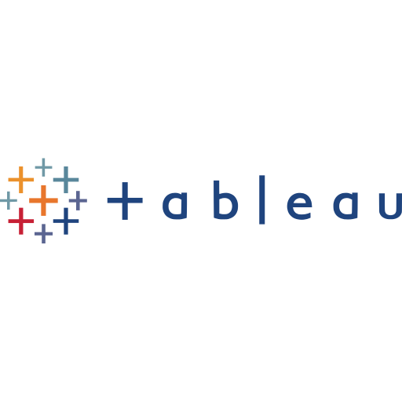

# Hi there, I'm Bulent - aka [bullor][linkedin]👋 

## I'm a Data Scientist with ML/Deep Learning experience and Telco Project Manager

- 🌱 I’m currently learning everything about Machine Learning 🤣
- 👯 I’m looking to collaborate with other content creators
- 🥅 2022 Goals: Learn more about Deep Learning algorithms.
- ⚡ Fun fact: I love to coach and play football .

### Connect with me:

[][linkedin]
&nbsp;&nbsp;
[][instagram]
[][discord]
[][notion]
[][kaggle]

### Languages and Tools:

[][Python]
[][Pytorch]
[][Numpy]
[][MatPlot]
[][Pandas]
[][ScikitLearn]
[][Scipy]
[][JupyterNotebook]
[][Pycharm]
[][Jira]
[][MySQL]
[][MongoDB]
[][GitHub]
[][VSCode]
[][Tableau]
[][Snowflake]

 
 

---

### 📕 Latest Blog Posts

<!-- BLOG-POST-LIST:START -->
- [Conversation Summaries in Google Chat](http://ai.googleblog.com/2022/11/conversation-summaries-in-google-chat.html)
- [The Data Cards Playbook: A Toolkit for Transparency in Dataset Documentation](http://ai.googleblog.com/2022/11/the-data-cards-playbook-toolkit-for.html)
- [Mixture-of-Experts with Expert Choice Routing](http://ai.googleblog.com/2022/11/mixture-of-experts-with-expert-choice.html)
- [Characterizing Emergent Phenomena in Large Language Models](http://ai.googleblog.com/2022/11/characterizing-emergent-phenomena-in.html)
- [Multi-layered Mapping of Brain Tissue via Segmentation Guided Contrastive Learning](http://ai.googleblog.com/2022/11/multi-layered-mapping-of-brain-tissue.html)
<!-- BLOG-POST-LIST:END -->

  
:zap: GitHub Stats

  

[instagram]: https://www.instagram.com/bulentorun/
[linkedin]: https://www.linkedin.com/in/bulentorun/
[discord]: https://discordapp.com/users/bullor#3245
[notion]: https://melted-taleggio-4e8.notion.site/66DaysOfData-for-Bulent-ORUN-ced084d9dd8948eb95d43d68ece29fd2
[kaggle]: https://www.kaggle.com/bulentorun
[Python]: https://www.python.org/
[Pytorch]: https://pytorch.org/
[Numpy]: https://numpy.org/
[MatPlot]: https://matplotlib.org/
[Pandas]: https://pandas.pydata.org/
[ScikitLearn]: https://scikit-learn.org/
[Scipy]: https://scipy.org/
[JupyterNotebook]: https://jupyter.org/
[Pycharm]: https://www.jetbrains.com/pycharm/
[Jira]: https://www.atlassian.com/software/jira
[MySQL]: https://www.mysql.com/
[MongoDB]: https://www.mongodb.com/
[GitHub]: https://github.com/
[VSCode]: https://code.visualstudio.com/
[Tableau]: https://www.tableau.com/
[Snowflake]: https://www.snowflake.com/

